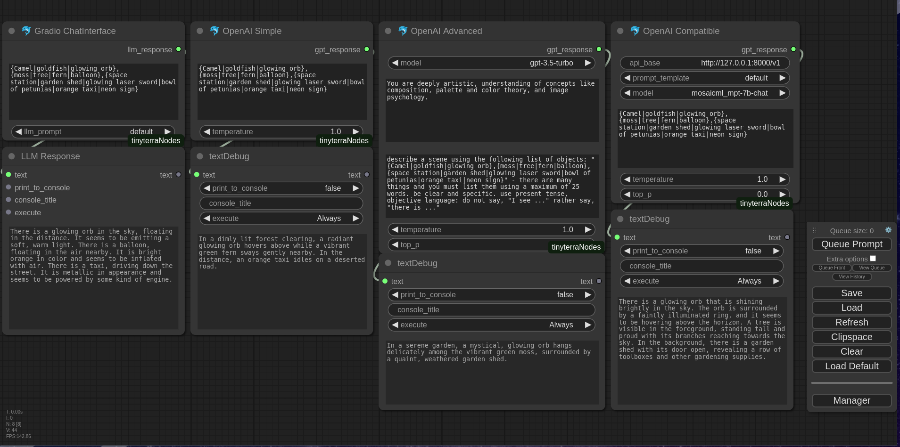
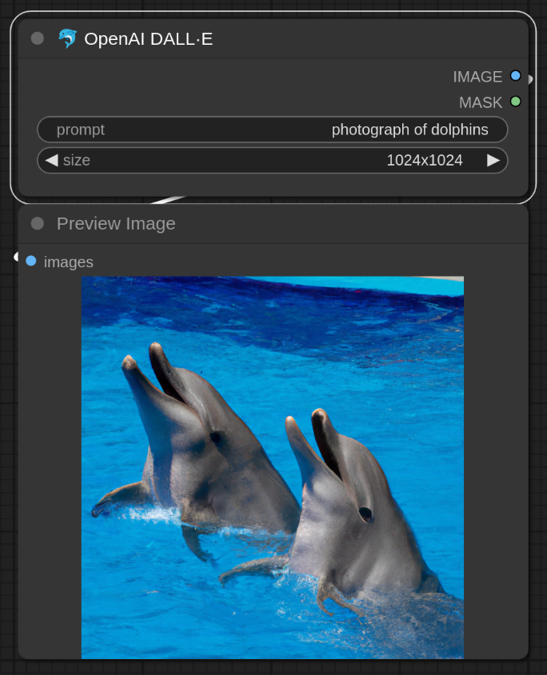

# Examples

## Cyber Dolphin

---

Get image prompt from OpenAI or a compatible API. By default `gpt-3.5-turbo` is used.

---

Compare the results of DALL·E and CLIP to see which one is better at generating images from text.

---
